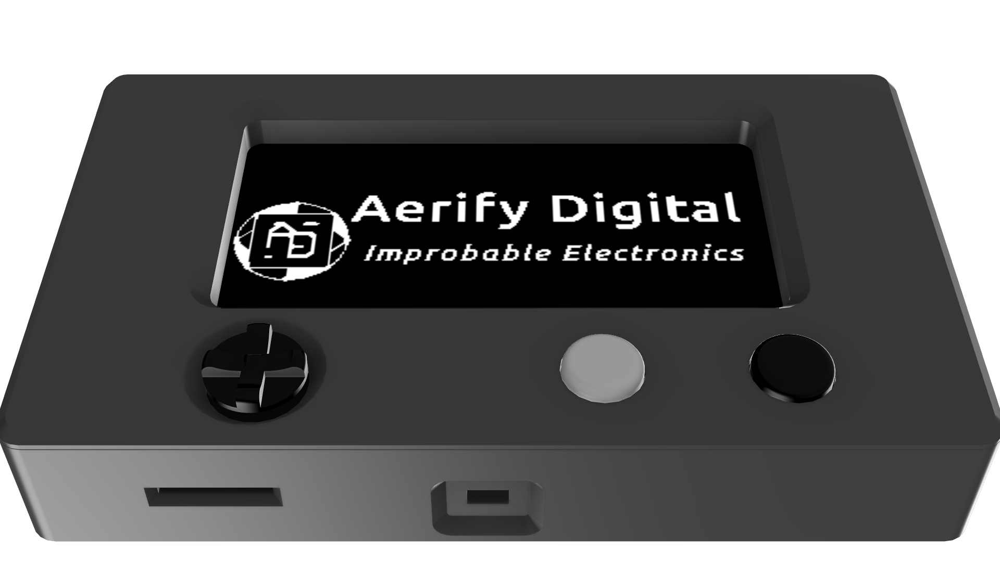

# AerID Business Card

 
The AerID is a fancy business card made by and for [Aerify Digital](https://aerify.digital).

## Features

- Rechargeable LIR2450 button cell battery
- Raspberry Pi RP2040 microcontroller
- E-Paper display (2.13" or 2.66")
- SD card slot for app and data storage
- Peizo buzzer
- Multiple buttons (D-pad with center press and 2 tactile buttons)
- 2 secure elements (ATECC508A and ATSHA204A) for cryptographic operations and secure secret storage
- ST25R100 NFC transceiver
- USB-C for power and data

## Versions

### AerID v0

Version 0 is a test run of the AerID business cards ordered at the end of 2025. Version 0 does not have a version printed on the board, however has 2025 printed on it.

This version was created to test the hardware before ordering the v1 version in 2026.
